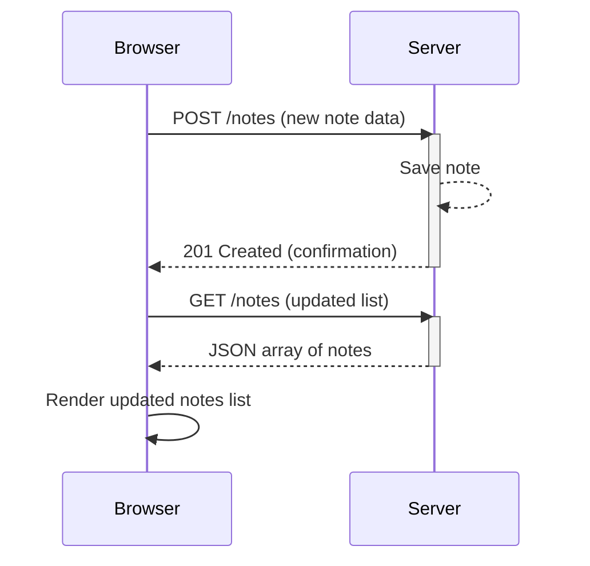

# Exercise 0.4 - New note diagram (Multi-page app)

```mermaid
sequenceDiagram
    participant Browser
    participant Server

    Browser->>Server: POST /notes (new note data)
    activate Server
    Server-->>Server: Save note
    Server-->>Browser: 201 Created (confirmation)
    deactivate Server

    Browser->>Server: GET /notes (updated list)
    activate Server
    Server-->>Browser: JSON array of notes
    deactivate Server

    Browser->>Browser: Render updated notes list
```
