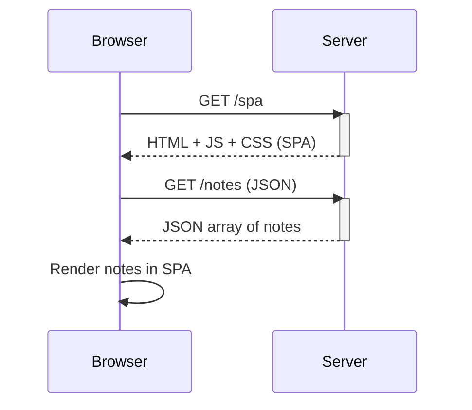

---

## File 0.5-spa-diagram.md

````markdown
# Exercise 0.5 - Single page app diagram


```mermaid
sequenceDiagram
    participant Browser
    participant Server

    Browser->>Server: GET /spa
    activate Server
    Server-->>Browser: HTML + JS + CSS (SPA)
    deactivate Server

    Browser->>Server: GET /notes (JSON)
    activate Server
    Server-->>Browser: JSON array of notes
    deactivate Server

    Browser->>Browser: Render notes in SPA
```
````
